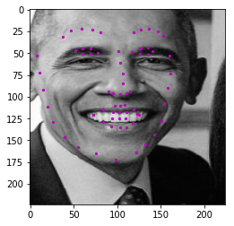
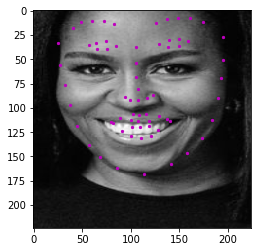

# Facial_Keypoint_Detection
This was my 1st project as part of the Udacity Computer Vision Nanodegree Program. 

From models.py, I defined the network architecture using the original Facial Keypoint Paper written by Naimish Agarwal et al. Check paper here https://arxiv.org/pdf/1710.00977.pdf 

In the 1st notebook, I instantiated the CNN architecture specified in models.py. The network takes in a grayscale, square image. I applied data transform to turn input image into a normalized, square, grayscale image and then a Tensor for the model to take it as input. I selected a loss function and optimizer for training the model. The model was trained using Google Colab's compute resources. 

In the 2nd notebook, I used Haar Cascade detector to detect faces in an image. Pre-processed those face images so that they are grayscaled, normalized and transformed into Tensors to be accepted as input to the trained model from Noteboook 1. The result is detetected faces with facial keypoints!

 

Code was developed in Pytorch. 

